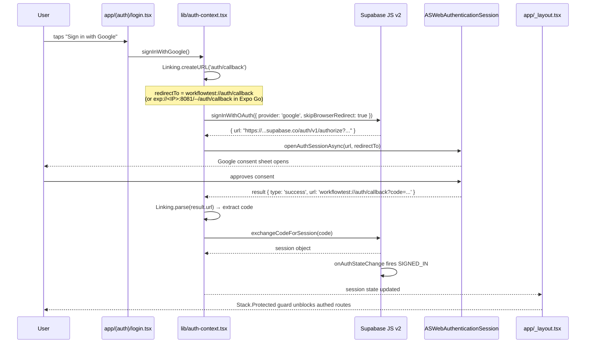

# Authentication Architecture

## Purpose

Documents the OAuth sign-in flow end-to-end: from the user tapping "Sign in with Google" to a session being active in the app. Covers why each configuration choice was made and the runtime quirks that affect the flow.

## Scope

- PKCE OAuth via Supabase + Google provider
- `ASWebAuthenticationSession` (iOS) via `expo-web-browser`
- Session persistence in `expo-secure-store` via the chunking adapter
- `AuthContext` emitting session to the rest of the app

**Not covered here:** token refresh (see `session-refresh.md`), the SecureStore chunking adapter internals (see `secure-store-adapter.md`), or how routes gate on session state (see `routing.md`).

## Flow

## How It Works

### 1. Initiating the flow

`signInWithGoogle()` in `lib/auth-context.tsx` calls `supabase.auth.signInWithOAuth` with `skipBrowserRedirect: true`. This tells the Supabase JS client to return the OAuth authorize URL instead of opening a browser itself — we control the browser lifecycle.

### 2. Opening the browser

`WebBrowser.openAuthSessionAsync(url, redirectTo)` opens the URL in `ASWebAuthenticationSession` on iOS. This is a system-managed sheet: it shares cookies with Safari, handles the Google consent screen, and automatically dismisses when Supabase redirects back to the `redirectTo` URL.

The call is blocking — it resolves when the sheet dismisses. `result.type` will be `'success'` (user completed the flow), `'cancel'` (user dismissed), or `'dismiss'` (programmatically closed).

### 3. Extracting the authorization code

On success, `result.url` is the full redirect URL including query parameters. `Linking.parse(result.url)` extracts `queryParams.code`. If `error` or `error_description` appear in the query params instead, the function returns an error to the caller.

### 4. Exchanging the code

`supabase.auth.exchangeCodeForSession(code)` sends the code to Supabase's token endpoint. Supabase validates the PKCE verifier it stored internally during step 1 and returns `access_token`, `refresh_token`, and provider tokens.

### 5. Session persistence

The Supabase JS client writes the session to the `storage` adapter configured in `lib/supabase.ts` — which is `ChunkedSecureStoreAdapter`. See `secure-store-adapter.md` for why.

### 6. AuthContext notifies the app

`AuthProvider` subscribes to `supabase.auth.onAuthStateChange` and updates the `session` state on every event. When the exchange completes, `SIGNED_IN` fires and `session` goes from `null` to the new session object. `ThemedRootStack` in `app/_layout.tsx` re-evaluates `isAuthed = !!session` and the `Stack.Protected` guard admits authed routes.

## Configuration choices

### `flowType: 'pkce'`

Required for React Native. The implicit flow (`flowType: 'implicit'`) works in browsers where the redirect URL fragment is available, but React Native's deep-link system returns query parameters, not fragments. PKCE also avoids exposing tokens in the redirect URL at all.

### `detectSessionInUrl: false`

Supabase's default (`true`) tries to parse the session from the current URL on load. In React Native there is no persistent "current URL" — this option must be `false` or the client attempts DOM APIs that don't exist.

### `skipBrowserRedirect: true`

Without this, `signInWithOAuth` would try to open the browser itself using an internal Supabase method that doesn't integrate with React Native's browser session tracking. We need `openAuthSessionAsync` to stay in control.

### `WebBrowser.maybeCompleteAuthSession()`

Called at the top of `lib/auth-context.tsx`. On web this signals to an auth popup that the session is complete; on React Native it is a no-op. It's present for correctness and future web support.

## Redirect URL quirks by runtime

| Runtime | `Linking.createURL('auth/callback')` |
|---|---|
| Expo Go | `exp://<LAN_IP>:8081/--/auth/callback` (changes per network) |
| Dev-client / standalone | `workflowtest://auth/callback` (stable) |

Supabase's Redirect URL allowlist matches the host literally. Wildcards only cover the path segment. This means:

- **Expo Go:** each LAN IP you develop from needs its own allowlist entry. The Site URL must also be updated to the current `exp://` address if it's the fallback.
- **Dev-client:** the `workflowtest://auth/callback` URL is stable and works everywhere once added to the allowlist once.

Recommendation: use a dev-client build for all OAuth testing.

## Key files & components

| File | Role |
|---|---|
| `lib/auth-context.tsx` | `AuthProvider` component + `signInWithGoogle` implementation |
| `lib/supabase.ts` | Supabase client creation; injects `ChunkedSecureStoreAdapter` as storage |
| `lib/secure-store-adapter.ts` | SecureStore chunking adapter |
| `app/(auth)/login.tsx` | UI that calls `signInWithGoogle()` |
| `app/_layout.tsx` | `AuthProvider` wrapper; `Stack.Protected` guards |
| `hooks/use-redirect-on-sign-in.ts` | Listens for `SIGNED_IN` and routes to onboarding |

## Dependencies

- `@supabase/supabase-js` v2 — auth client
- `expo-web-browser` — `openAuthSessionAsync`, `maybeCompleteAuthSession`
- `expo-linking` — `createURL`, `parse`
- `expo-secure-store` — underlying Keychain/Keystore storage

## Configuration

| Variable | Where | Notes |
|---|---|---|
| `EXPO_PUBLIC_SUPABASE_URL` | `.env` | Project URL from Supabase dashboard |
| `EXPO_PUBLIC_SUPABASE_ANON_KEY` | `.env` | Public anon key; safe to ship in binary |
| Redirect URL allowlist | Supabase dashboard → Auth → URL Configuration | Add `workflowtest://auth/callback` and any `exp://` addresses used in Expo Go |
| Site URL | Supabase dashboard → Auth → URL Configuration | Set to `workflowtest://auth/callback` for dev-client dev |

## Gotchas / known limitations

- **`react-native-url-polyfill/auto` must be the first import in `app/_layout.tsx`.** Hermes's `URL` implementation is incomplete and Supabase depends on it. Moving this import below any Supabase-transitively-importing module will break session parsing.
- **`lib/supabase.ts` throws at import if env vars are missing.** `jest-setup.ts` injects placeholder values for the test environment. Don't change to lazy-throw without updating tests.
- **Google OAuth consent screen runs inside `ASWebAuthenticationSession`.** Maestro cannot drive this sheet. Auth flows must be tested with Jest/RNTL + mocked `useAuth`, not E2E automation.
- **`expo-auth-session` is installed as a dependency** (`^7.0.10` in `package.json`) but is not used. The auth flow is wired through Supabase JS directly + `expo-web-browser`. This is a stale dependency from the initial project scaffold.

## Cross-refs

- `docs/architecture/secure-store-adapter.md` — chunking adapter details
- `docs/architecture/session-refresh.md` — token auto-refresh via AppState
- `docs/architecture/routing.md` — `Stack.Protected` guards
- `docs/authentication/sign-in-screen.md` — login screen UI spec
- `docs/onboarding/post-signin-redirect.md` — what happens after `SIGNED_IN`
