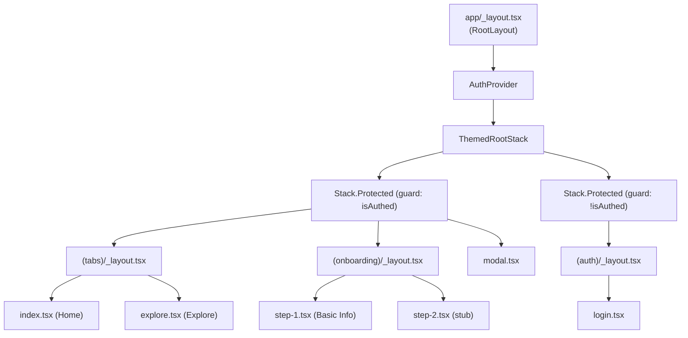

# Routing

## Purpose

Describes the Expo Router v6 file-based routing structure, the route groups, how authentication gates routes, and the deep-link scheme.

## Scope

- File layout under `app/`
- `Stack.Protected` auth guards
- Typed routes
- `unstable_settings.anchor`
- `scheme: "workflowtest"` for deep links

**Not covered:** individual screen UIs (see the per-feature docs); OAuth redirect URL quirks (see `authentication.md`).

## Route tree



## How it works

### File-based routing

Every `.tsx` file in `app/` is automatically a route. Folder names in parentheses — `(auth)`, `(tabs)`, `(onboarding)` — are **route groups**: they affect the URL structure and layout nesting without adding a URL path segment.

| Route group | URL prefix | Access |
|---|---|---|
| `(auth)` | `/` (e.g. `/login`) | Unauthenticated only |
| `(tabs)` | `/` (tab root) | Authenticated only |
| `(onboarding)` | `/onboarding/...` | Authenticated only |

### Stack.Protected guards

`app/_layout.tsx` uses two `Stack.Protected` blocks:

```tsx
<Stack.Protected guard={isAuthed}>
  <Stack.Screen name="(tabs)" ... />
  <Stack.Screen name="(onboarding)" ... />
  <Stack.Screen name="modal" ... />
</Stack.Protected>
<Stack.Protected guard={!isAuthed}>
  <Stack.Screen name="(auth)" ... />
</Stack.Protected>
```

`isAuthed` is `!!session` from `useAuth()`. While `loading === true` (before the initial `getSession` call resolves), the component returns `null` to avoid flashing the wrong stack on cold start.

### unstable_settings.anchor

```ts
export const unstable_settings = {
  anchor: '(tabs)',
};
```

This tells Expo Router that `(tabs)` is the "home" of the authenticated stack. When the user navigates away from `(tabs)` (e.g., to onboarding) and presses Back, the navigator returns to `(tabs)` rather than the pre-authentication screen.

### Typed routes

`app.json` sets `experiments.typedRoutes: true`. This generates typed route strings in `.expo/types/router.d.ts`. The current codebase uses `as never` casts in a couple of places (e.g., `push('/onboarding/step-2' as never)`) because the generated types for groups with nested paths can lag behind the actual file layout. This is a minor friction point, not a bug.

### Deep links

`app.json` sets `scheme: "workflowtest"`. Any URL of the form `workflowtest://<path>` deep-links into the app. This scheme is used for:

- OAuth redirect: `workflowtest://auth/callback`
- Maestro E2E test navigation: `workflowtest://onboarding/step-1`

The iOS bundle identifier is `com.workflowtest.app`. Changing either `scheme` or `bundleIdentifier` requires updating the Supabase redirect URL allowlist.

## Key files & components

| File | Role |
|---|---|
| `app/_layout.tsx` | Root layout; `AuthProvider` wrapper; `Stack.Protected` guards; `unstable_settings` |
| `app/(auth)/_layout.tsx` | Auth group layout; headerless Stack |
| `app/(auth)/login.tsx` | Sign-in screen |
| `app/(tabs)/_layout.tsx` | Tab bar layout (Home, Explore) |
| `app/(tabs)/index.tsx` | Home screen (placeholder) |
| `app/(tabs)/explore.tsx` | Explore screen (placeholder) |
| `app/(onboarding)/_layout.tsx` | Onboarding group layout; headerless Stack |
| `app/(onboarding)/step-1.tsx` | Basic info form |
| `app/(onboarding)/step-2.tsx` | Stub ("Step 2 coming soon") |
| `app/modal.tsx` | Modal screen (presented modally) |
| `.expo/types/router.d.ts` | Auto-generated typed route definitions |

## Dependencies

- `expo-router` ~6.0.23
- `app.json` `experiments.typedRoutes: true`
- `app.json` `scheme: "workflowtest"`

## Gotchas / known limitations

- **`(tabs)` and `(onboarding)` are both behind the same `guard={isAuthed}` block.** If a returning user with an existing session lands on the root, `Stack.Protected` will admit them to whichever route Expo Router resolves as the initial route — which defaults to the `(tabs)` group (enforced by `unstable_settings.anchor`). There is currently no logic to redirect a user who has NOT completed onboarding away from `(tabs)`. That requires a profile-completion flag that isn't implemented yet. See `post-signin-redirect.md`.
- **`as never` casts** in `step-1.tsx` (`push('/onboarding/step-2' as never)`) and `use-redirect-on-sign-in.ts` (`replace('/onboarding/step-1' as never)`) are workarounds for typed-routes inference gaps. They are safe but should be replaced once the generated types stabilize.
- **`modal.tsx` is a scaffold leftover** from the initial Expo template. It is not used by any product feature yet.

## Cross-refs

- `docs/architecture/authentication.md` — how `Stack.Protected` and the auth state interact
- `docs/architecture/session-refresh.md` — `AppState` listener in `app/_layout.tsx`
- `docs/onboarding/post-signin-redirect.md` — post-login routing logic
